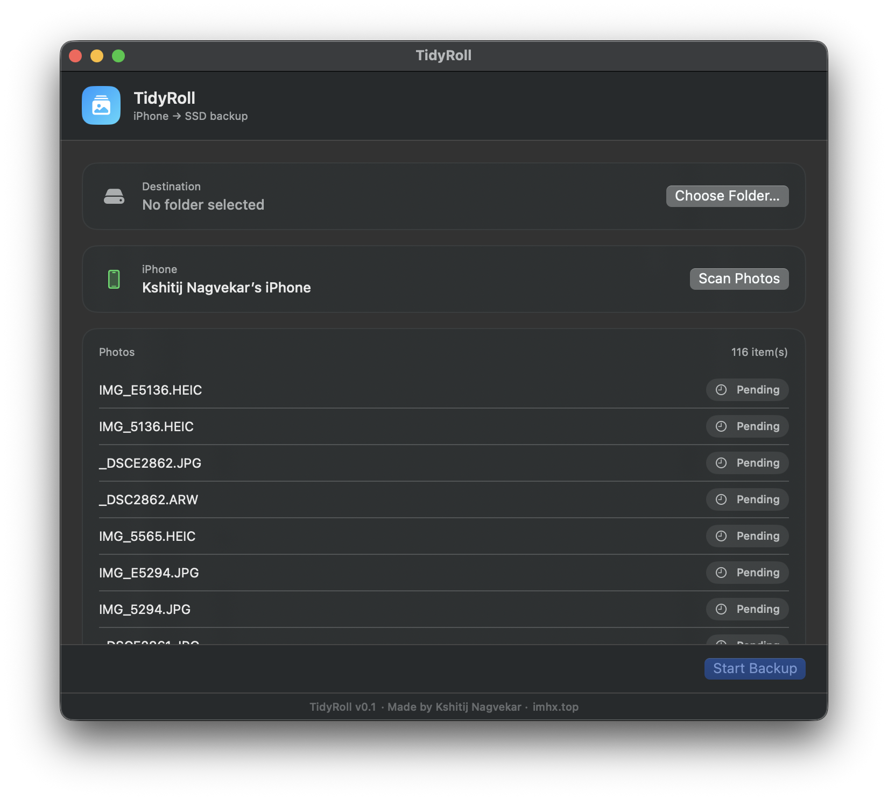

# TidyRoll

A macOS menu utility that backs up photos and videos from a USB-connected
iPhone to an external drive, automatically organized by date and location —
so your library stays tidy without manual sorting.



## Features

- **USB-only, no iCloud required** — talks to the iPhone directly over USB via
  ImageCaptureCore, so nothing has to pass through iCloud or the Photos app.
- **Automatic organization** — files are sorted into
  `<destination>/YY-MM/<City, Country>`, falling back to `<destination>/YY-MM`
  when a photo has no GPS data, using EXIF/video metadata and reverse
  geocoding.
- **Copy, then verify** — every file is copied and size-verified against the
  source before it's ever considered "backed up."
- **Duplicate-aware scanning** — re-scanning checks your destination folder
  first and skips photos that are already backed up.
- **Safe deletion** — after a successful, verified backup you're asked to
  confirm before TidyRoll deletes the originals from the iPhone. Already
  backed-up photos can also be cleared from the phone on demand.
- **Live status** — in-app progress for scanning, backing up, and deleting,
  with clear success/failure states and retry for anything that failed.
- **Disconnect-safe** — detects when the iPhone is unplugged mid-operation and
  stops cleanly instead of hanging.

## Requirements

- macOS 13 (Ventura) or later
- An iPhone connected via USB cable
- Swift 5.9+ / Xcode command line tools (to build from source)

## Building

TidyRoll is a Swift Package Manager project with a SwiftUI app target.

```bash
swift build
```

To produce a double-clickable `.app` bundle:

```bash
mkdir -p build/TidyRoll.app/Contents/{MacOS,Resources}
cp .build/debug/TidyRoll build/TidyRoll.app/Contents/MacOS/TidyRoll
cp Resources/AppIcon.icns build/TidyRoll.app/Contents/Resources/AppIcon.icns
cp Resources/Info.plist build/TidyRoll.app/Contents/Info.plist
open build/TidyRoll.app
```

## How it works

1. Connect your iPhone via USB and trust the computer if prompted.
2. Choose a destination folder on your external drive.
3. Click **Scan Photos** — TidyRoll reads the device's media library and
   checks your destination for anything already backed up.
4. Click **Start Backup** — each photo is downloaded, read for date/GPS
   metadata, copied into the right `YY-MM/City, Country` folder, and
   verified.
5. Once finished, confirm deletion from the iPhone (optional, always asked
   before anything is removed from the device).

## License

MIT — see [LICENSE](LICENSE).

## Author

Made by [Kshitij Nagvekar](https://imhx.top).
